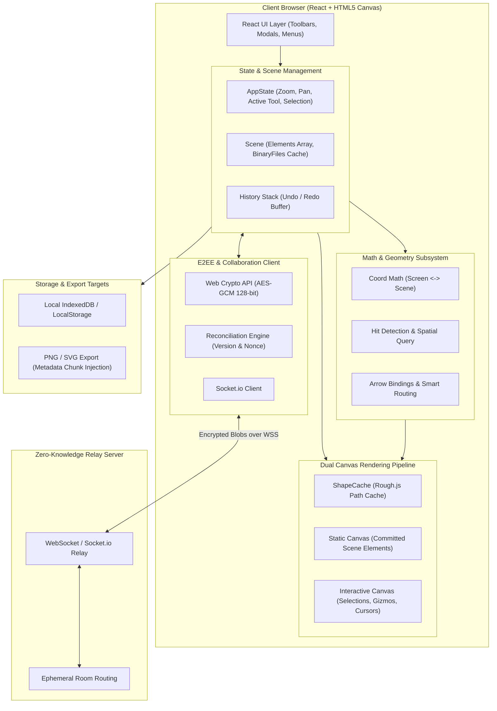
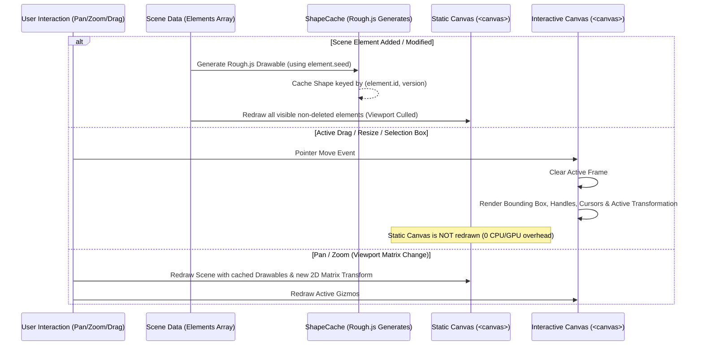
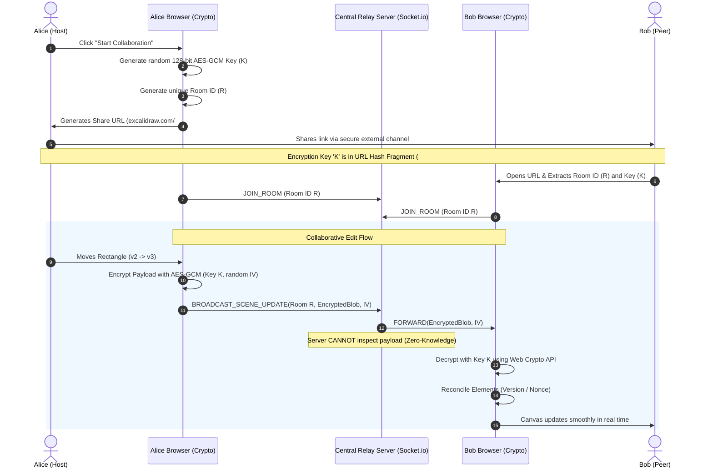

# Excalidraw Architecture & System Design

This document provides a comprehensive technical overview of **Excalidraw**—the open-source, collaborative virtual whiteboard known for its signature hand-drawn aesthetic, real-time collaboration, and zero-knowledge end-to-end encryption.

---

## 1. System Overview & Core Tenets

Excalidraw is engineered around several core design principles:

1. **Local-First & Zero-Knowledge Privacy**: Data is owned by the client. Diagrams can be fully created, manipulated, and exported offline. When collaborating, data is encrypted client-side before touching any network wire.
2. **Hand-Drawn ("Sketchy") Aesthetic with Deterministic Rendering**: Uses algorithmic path jitter and hand-drawn styling (via [Rough.js](https://roughjs.com/)) while caching shapes to prevent jitter during viewport transformations.
3. **High-Performance Hybrid Canvas**: Leverages HTML5 Dual-Canvas rendering (static background layer + active interactive layer) combined with coordinate projection math and viewport culling.
4. **Decentralized Conflict Resolution**: Concurrent edits are reconciled using a lightweight, deterministic versioning algorithm (monotonic version + randomized nonce) without requiring a heavyweight operational transformation (OT) engine.
5. **Universal Portability & Embedded Self-Contained Files**: Exported PNG and SVG images contain the entire raw JSON scene embedded within image metadata chunks, allowing them to function simultaneously as visual assets and editable project files.

---

## 2. High-Level Architecture



---

## 3. Core Data Model & State Representation

The Excalidraw scene is modeled as a flat, ordered array of JSON-serializable elements and a centralized application state object.

### 3.1 `ExcalidrawElement` Schema

Every shape on the canvas—rectangles, diamonds, ellipses, arrows, text, freehand lines, images, and frames—implements a base element interface:

```typescript
interface ExcalidrawElement {
  id: string;                      // Unique UUID
  type: "rectangle" | "diamond" | "ellipse" | "arrow" | "line" | "freedraw" | "text" | "image" | "frame";
  x: number;                       // Top-left X coordinate in scene space
  y: number;                       // Top-left Y coordinate in scene space
  width: number;                   // Bounding box width
  height: number;                  // Bounding box height
  angle: number;                   // Rotation angle in radians
  strokeColor: string;             // Hex/RGBA stroke color
  backgroundColor: string;         // Fill color
  fillStyle: "hachure" | "cross-hatch" | "solid" | "dots" | "zigzag";
  strokeWidth: number;             // Border thickness
  strokeStyle: "solid" | "dashed" | "dotted";
  roughness: number;               // 0 (clean/architectural) to 2+ (sketchy)
  opacity: number;                 // 0 to 100
  groupIds: readonly string[];     // Array of grouping IDs for multi-select
  frameId: string | null;          // Parent frame container ID
  roundness: null | { type: number; value?: number }; // Corner rounding / radius
  seed: number;                    // Deterministic seed for Rough.js pseudorandom paths
  version: number;                 // Monotonically increasing edit counter
  versionNonce: number;            // Random 32-bit int to break version ties
  isDeleted: boolean;              // Soft-deletion flag for sync and undo/redo
  updated: number;                 // Timestamp of last local edit
  link: string | null;             // Optional hyperlink
  locked: boolean;                 // Prevention of accidental modification
  customData?: Record<string, any>;// Extension hook for third-party integrations
}
```

#### Specialized Sub-Elements:
- **`ExcalidrawLinearElement`** (`line`, `arrow`): Stores `points: readonly [x, y][]`, `startBinding`, `endBinding`, and arrowheads (`arrow`, `triangle`, `dot`, `bar`).
- **`ExcalidrawTextElement`**: Stores `text`, `fontSize`, `fontFamily` (1 = Virgil, 2 = Helvetica, 3 = Cascadia/Code, 4 = Comic Shanns), `textAlign`, `verticalAlign`, `containerId` (for text bound inside shapes).
- **`ExcalidrawImageElement`**: Stores `fileId` (SHA-256 hash pointing to binary storage), `scale`, `status` (`idle`, `loading`, `error`).

### 3.2 `AppState`
The `AppState` represents transient UI state, viewport configuration, and tool settings:
- **Viewport Transform**: `zoom: { value: number }`, `scrollX: number`, `scrollY: number`.
- **Selection & Interaction**: `selectedElementIds: { [id: string]: boolean }`, `editingElement: ExcalidrawElement | null`, `resizingElement`, `multiElement: ExcalidrawLinearElement | null`.
- **UI Settings**: `theme: "light" | "dark"`, `gridSize: number | null`, `viewModeEnabled: boolean`.
- **Collaboration**: `collaborators: Map<SocketId, CollaboratorPointerState>`.

### 3.3 Soft Deletion & Tombstoning
Elements are **never immediately removed from the array**. Instead, `isDeleted: true` is assigned:
1. Prevents resurrection anomalies during concurrent collaborative sync (a delete arriving after an in-flight edit will reliably supersede it).
2. Maintains undo/redo stack consistency without pointer invalidation.
3. Tombstones are garbage-collected after a retention timeout (`DELETED_ELEMENT_TIMEOUT = 24h` or on explicit file cleanup).

---

## 4. Rendering Pipeline & Graphics Subsystem

Excalidraw avoids traditional DOM-based canvas wrappers (like SVG trees or standard canvas frameworks) in favor of a **custom Dual-Canvas pipeline** optimized for 60fps interaction on infinite canvases.



### 4.1 Dual-Canvas Architecture
Excalidraw stacks two `<canvas>` elements over each other:

| Canvas Layer | Purpose | Repaint Frequency | Performance Strategy |
| :--- | :--- | :--- | :--- |
| **Static Canvas** (Bottom) | Renders all committed scene shapes, strokes, text, and images. | Only on element creation, property modification, or viewport pan/zoom. | Off-screen rendering + `ShapeCache` retrieval. |
| **Interactive Canvas** (Top) | Renders active transform handles, multi-select bounding boxes, alignment snap lines, laser pointer trails, and remote cursors. | Every `requestAnimationFrame` (60-120 FPS) during active mouse/touch events. | Cleared and repainted instantly without re-evaluating scene geometry. |

### 4.2 Rough.js Integration & `ShapeCache`
Rough.js creates organic lines by introducing controlled jitter and double-stroke path offsets. 
- **The Problem**: Running Rough.js algorithms for thousands of elements per frame causes massive CPU overhead and causes shapes to "vibrate" / jitter on every repaint.
- **The Solution (`ShapeCache`)**:
  1. When an element is created or its properties change, Excalidraw passes its geometry and deterministic `element.seed` to Rough.js to generate a `Drawable` path instruction object.
  2. The `Drawable` is cached in `ShapeCache` using a compound key: `(element.id, element.version)`.
  3. During standard canvas renders, the engine retrieves pre-calculated `Drawable` paths from cache and executes `roughCanvas.draw(drawable)`.
  4. Visual stability is preserved during panning, zooming, or moving other elements.

### 4.3 Viewport Culling
Before drawing, elements are filtered against the viewport bounding box:
$$\text{visible} = \text{intersects}(\text{element.boundingBox}, \text{viewportBounds})$$
Elements completely off-screen are skipped, maintaining high framerates regardless of overall scene complexity.

---

## 5. Geometry, Hit Detection & Spatial Math

Because HTML5 Canvas is an immediate-mode raster surface with no built-in scene graph or DOM event handlers, Excalidraw implements its own coordinate math and hit-testing engine:

### 5.1 Coordinate Transforms
- **Scene Coordinates**: Canonical $(x, y)$ coordinates in the infinite 2D plane.
- **Screen/Viewport Coordinates**: Pixel coordinates relative to the client's screen viewport.

$$\text{sceneX} = \frac{\text{screenX} - \text{scrollX}}{\text{zoom}}, \quad \text{sceneY} = \frac{\text{screenY} - \text{scrollY}}{\text{zoom}}$$

$$\text{screenX} = (\text{sceneX} \cdot \text{zoom}) + \text{scrollX}, \quad \text{screenY} = (\text{sceneY} \cdot \text{zoom}) + \text{scrollY}$$

### 5.2 Hit Detection & Transform Math
- **Point-in-Shape**:
  - Rectangles & Ellipses: Point-in-polygon / distance to center scaled by ellipse axes.
  - Linear/Freedraw Elements: Computes minimum distance from mouse cursor $(x_0, y_0)$ to line segment $(p_1, p_2)$ with an interactive hit threshold (e.g., $10\text{px} / \text{zoom}$).
- **Rotated Bounding Boxes**: Transforms the test coordinate by the inverse rotation matrix $(- \theta)$ around the element center before testing against unrotated axis-aligned bounds.

### 5.3 Smart Arrow Bindings & Auto-Routing
Excalidraw supports two-way dynamic connections between arrows and shapes:
- **Binding Metadata**: An arrow element stores `startBinding: { elementId, focus, gap }` and `endBinding`.
- **Target Tracking**: The bound target shape stores `boundElementIds: [arrowId, ...]`.
- **Geometric Intersection Calculation**: When the target element moves or resizes, the arrow endpoints automatically recompute their intersection coordinates against the target element's convex boundary.
- **Elbow Arrows**: Orthogonal routing uses pathfinding algorithms (modified A* / Manhattan routing) to navigate around intermediate bounding boxes without overlapping shapes.

---

## 6. Real-Time Collaboration & End-to-End Encryption (E2EE)

Excalidraw's multi-user collaboration implements a **zero-knowledge pseudo-peer-to-peer** design.



### 6.1 Key Distribution via URL Hash Fragments
The fundamental cryptographic challenge of browser-based E2EE is sharing symmetric keys without exposing them to the backend server.
- The encryption key is placed in the **URL hash fragment**:
  `https://excalidraw.com/#room=847a82b9...,dKj84F9_2kLms920f...`
- Per RFC specifications, web browsers **never transmit the hash fragment (`#...`) to the HTTP web server**.
- The server only facilitates room routing based on the room ID; it never receives, logs, or possesses the decryption key.

### 6.2 Data Sync & Cryptographic Primitives
- **Algorithm**: AES-GCM (128-bit / 256-bit) via standard client `window.crypto.subtle`.
- **Initialization Vector (IV)**: A cryptographically secure 12-byte random IV is generated for every transmitted message packet.
- **Relay Protocol**: WebSocket / Socket.io room broadcasts. The relay server acts purely as an encrypted packet router.

### 6.3 Element Reconciliation Algorithm
Excalidraw resolves concurrent multi-user conflicts without complex operational transforms using a **deterministic Last-Write-Wins (LWW) element versioning model**:

```typescript
function reconcileElements(
  localElements: readonly ExcalidrawElement[],
  remoteElements: readonly ExcalidrawElement[]
): ExcalidrawElement[] {
  const elementMap = new Map<string, ExcalidrawElement>();

  // 1. Index local elements
  for (const el of localElements) {
    elementMap.set(el.id, el);
  }

  // 2. Reconcile with incoming remote elements
  for (const remote of remoteElements) {
    const local = elementMap.get(remote.id);

    if (!local) {
      // New remote element
      elementMap.set(remote.id, remote);
      continue;
    }

    // Comparison criteria:
    // a) Higher version wins
    // b) If versions tie, higher versionNonce breaks the tie deterministically
    if (
      remote.version > local.version ||
      (remote.version === local.version && remote.versionNonce > local.versionNonce)
    ) {
      elementMap.set(remote.id, remote);
    }
  }

  return Array.from(elementMap.values());
}
```

---

## 7. Storage, Serialization & Embedded Image Formats

Excalidraw features an innovative file storage strategy that embeds entire interactive diagrams directly into standard image files.

### 7.1 Native `.excalidraw` Format
The native file format is a UTF-8 JSON file:
```json
{
  "type": "excalidraw",
  "version": 2,
  "source": "https://excalidraw.com",
  "elements": [ ... ],
  "appState": {
    "gridSize": null,
    "viewBackgroundColor": "#ffffff"
  },
  "files": {
    "fileId_sha256": {
      "mimeType": "image/png",
      "id": "fileId_sha256",
      "dataURL": "data:image/png;base64,...",
      "created": 1693500000000
    }
  }
}
```

### 7.2 PNG Scene Embedding (`tEXt` Chunk Steganography)
When exporting as a PNG image with "Embed Scene" enabled:
1. The canvas is rasterized to standard PNG pixels.
2. The entire `.excalidraw` JSON string is packed into an official PNG **`tEXt`** or **`iTXt`** metadata chunk with the key identifier `application/json`.
3. The resulting file opens as an ordinary image in any image viewer, browser, or photo editor.
4. When dragged back into Excalidraw, the file reader scans binary chunks for the `tEXt: application/json` header, extracts the JSON payload, and reconstructs the fully editable vector scene.

### 7.3 SVG Metadata Embedding
For SVG exports, the serialized scene JSON is base64-encoded or embedded directly inside standard `<metadata>` tags or XML comment blocks (`<!-- payload-start ... payload-end -->`), providing the same dual-purpose behavior for vector formats.

---

## 8. Package & Monorepo Architecture

Excalidraw is maintained as a modular monorepo:

```
excalidraw/
├── packages/
│   ├── excalidraw/           # Core embeddable NPM package (@excalidraw/excalidraw)
│   │   ├── components/       # React UI components (Toolbar, ColorPicker, Canvas)
│   │   ├── scene/            # Scene graph, coordinate math, spatial queries
│   │   ├── renderer/         # Dual canvas rendering, Rough.js integration
│   │   ├── data/             # Serialization, PNG/SVG encoding & decoding
│   │   └── actions/          # Discrete state mutation commands (undo/redo actions)
│   ├── math/                 # Standalone 2D vector & matrix math utilities
│   ├── utils/                # General helpers, color space transforms, browser polyfills
│   └── element/              # Core element types and shape definition factories
├── excalidraw-app/           # Standalone production web application (PWA + Collab UI)
└── room-server/              # Ephemeral WebSocket / Socket.io relay service
```

### 8.1 Core Package API (`@excalidraw/excalidraw`)
Applications can embed Excalidraw as a React component:

```tsx
import { Excalidraw } from "@excalidraw/excalidraw";

export default function WhiteboardApp() {
  return (
    <div style={{ height: "100vh", width: "100vw" }}>
      <Excalidraw
        initialData={{ elements: [], appState: { theme: "light" } }}
        onChange={(elements, appState, files) => {
          // Handle real-time state change or local persistence
        }}
        UIOptions={{
          canvasActions: {
            export: { saveAsImage: true },
            loadScene: true,
          }
        }}
      />
    </div>
  );
}
```

---

## 9. Architectural Summary Matrix

| Subsystem | Architectural Choice | Key Benefit | Trade-off / Limitation |
| :--- | :--- | :--- | :--- |
| **Graphics Engine** | HTML5 Dual-Canvas + Rough.js | Smooth 60fps performance + unique hand-drawn aesthetic. | Immediate-mode rendering requires manual hit-testing and spatial math. |
| **Path Optimization** | `ShapeCache` with deterministic seeds | Prevents visual jitter during pan/zoom; minimizes CPU cycles. | Memory overhead caching `Drawable` objects in RAM. |
| **Collaboration** | Pseudo-P2P Relay + WebSockets | Low-cost infrastructure; server only routes encrypted binary packets. | Server cannot validate schema correctness or resolve server-side business logic. |
| **Security & Privacy**| E2EE with Key in URL Hash Fragment | Zero-knowledge architecture; web servers cannot read user diagrams. | Losing the share link means unrecoverable lost data (no central admin reset). |
| **Conflict Resolution** | Deterministic LWW (Version + Nonce) | Extremely lightweight; avoids complexity of CRDTs/OT. | Fine-grained intra-element concurrent edits (e.g. two users typing in one text box) resolve via last-write. |
| **File Portability** | PNG `tEXt` / SVG Metadata chunking | Single file serves as both standard image preview and editable project file. | Slightly larger image file sizes. |
