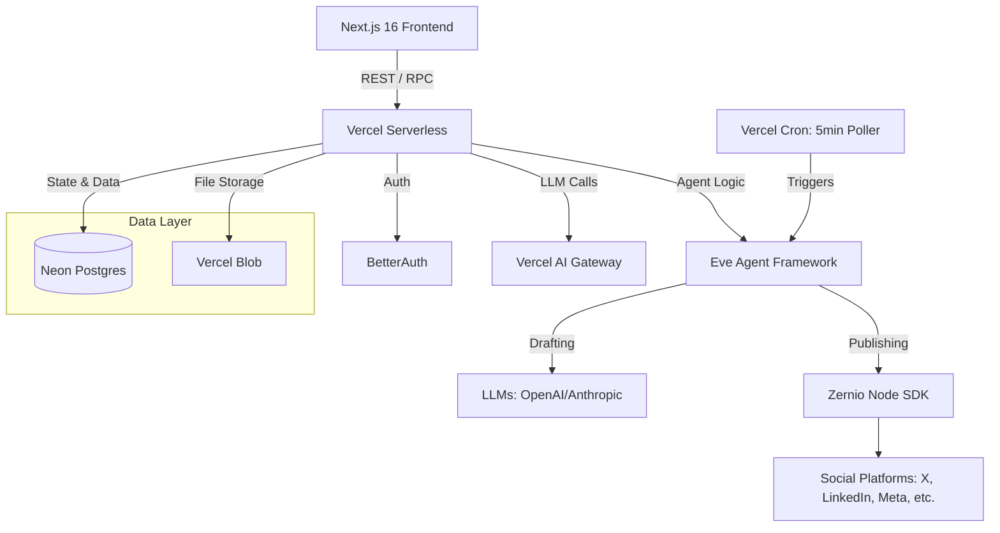

# Technical Requirements Document: Social Media Agent Platform

## 1. Overview
This document outlines the technical requirements and architecture for a multi-tenant Social Media Agent Platform. The platform leverages AI to autonomously draft, schedule, and publish content across 14+ social networks on behalf of users, utilizing human-in-the-loop approvals for safe publishing.

## 2. Technology Stack
- **Frontend**: Next.js 16 (App Router), React 19, shadcn/ui, Tailwind CSS v4, Zustand, TanStack Query
- **Agent Framework**: Eve (Vercel's framework, beta)
- **Social Media API**: Zernio Node SDK (`@zernio/node`)
- **Database**: Neon Serverless Postgres
- **Authentication**: BetterAuth (Postgres-backed, plugin-based)
- **LLM Routing**: Vercel AI SDK + AI Gateway
- **Deployment**: Vercel (Serverless)
- **File Storage**: Vercel Blob

## 3. System Architecture

### 3.1 Architecture Diagram


### 3.2 Critical Architecture Decisions
* **Scheduling**: Uses a single Vercel cron job polling every 5 minutes instead of per-tenant crons. It queries Postgres to determine which tenants are due for action based on their configured timezone and cadence.
* **API Keys (BYOK)**: Stored server-side using AES-256-GCM encryption in Postgres. Keys are decrypted at runtime by background jobs.
* **Failure/Retry Strategy**: Exponential backoff (1s/5s/30s) for Zernio calls. Immediate tenant pause on 401/403 (revoked keys).
* **LLM Spend Caps**: Postgres tracks token usage. Eve's session limits (`maxInputTokensPerSession`, `maxOutputTokensPerSession`) are enforced.
* **Platform Automation Policies**: Implements AI-content disclosure in agent instructions and respects rate limits.

## 4. Data Model
All tables utilize `tenant_id` for row-level multi-tenancy.

```sql
-- Core Auth & Tenants
CREATE TABLE tenants (
    id UUID PRIMARY KEY DEFAULT gen_random_uuid(),
    name VARCHAR(255) NOT NULL,
    created_at TIMESTAMP WITH TIME ZONE DEFAULT NOW()
);

CREATE TABLE users (
    id UUID PRIMARY KEY DEFAULT gen_random_uuid(),
    tenant_id UUID REFERENCES tenants(id) ON DELETE CASCADE,
    email VARCHAR(255) UNIQUE NOT NULL,
    role VARCHAR(50) DEFAULT 'member',
    created_at TIMESTAMP WITH TIME ZONE DEFAULT NOW()
);

-- Agent Configuration & Spending
CREATE TABLE agent_configs (
    id UUID PRIMARY KEY DEFAULT gen_random_uuid(),
    tenant_id UUID REFERENCES tenants(id) ON DELETE CASCADE UNIQUE,
    posting_schedule JSONB NOT NULL, -- e.g., {"timezone": "America/New_York", "cadence": "daily", "times": ["09:00", "15:00"]}
    persona TEXT,
    brand_voice TEXT,
    is_paused BOOLEAN DEFAULT FALSE,
    token_budget_monthly INTEGER DEFAULT 1000000,
    tokens_used_current_month INTEGER DEFAULT 0
);

-- Secrets Management
CREATE TABLE api_keys (
    id UUID PRIMARY KEY DEFAULT gen_random_uuid(),
    tenant_id UUID REFERENCES tenants(id) ON DELETE CASCADE,
    provider VARCHAR(50) NOT NULL, -- 'openai', 'zernio'
    encrypted_key TEXT NOT NULL,
    iv TEXT NOT NULL,
    status VARCHAR(50) DEFAULT 'active' -- 'active', 'revoked'
);

-- Social Accounts & Sub-Entities
CREATE TABLE social_accounts (
    id UUID PRIMARY KEY DEFAULT gen_random_uuid(),
    tenant_id UUID REFERENCES tenants(id) ON DELETE CASCADE,
    platform VARCHAR(50) NOT NULL,
    external_account_id TEXT NOT NULL,
    name TEXT
);

CREATE TABLE social_entities (
    id UUID PRIMARY KEY DEFAULT gen_random_uuid(),
    social_account_id UUID REFERENCES social_accounts(id) ON DELETE CASCADE,
    entity_type VARCHAR(50) NOT NULL, -- 'page', 'board', 'company_page', 'profile'
    entity_id TEXT NOT NULL,          -- Zernio entity ID
    entity_name TEXT NOT NULL,
    is_active BOOLEAN DEFAULT TRUE
);

-- Posts & Approvals
CREATE TABLE posts (
    id UUID PRIMARY KEY DEFAULT gen_random_uuid(),
    tenant_id UUID REFERENCES tenants(id) ON DELETE CASCADE,
    status VARCHAR(50) DEFAULT 'draft', -- 'draft', 'pending_approval', 'approved', 'published', 'failed'
    content TEXT NOT NULL,
    media_urls TEXT[],
    scheduled_for TIMESTAMP WITH TIME ZONE,
    published_at TIMESTAMP WITH TIME ZONE,
    target_entities UUID[] -- Array of social_entities IDs
);
```

## 5. Eve Agent Architecture
The agent system is built on Vercel's `eve` framework.

### 5.1 Schedules
**App-Level Polling Schedule**:
```typescript
// agent/schedules/tenant-poll.ts
import { defineSchedule } from 'eve/schedules';

export default defineSchedule({
  cron: '*/5 * * * *',
  markdown: 'Check which tenants are due for content drafting based on their posting_schedule. For each due tenant, draft a post using their persona, brand voice, and target platforms.'
});
```

### 5.2 Dynamic Context
Uses `defineDynamic` to load tenant-specific instructions, persona, and brand voice at runtime, ensuring tenant isolation within the agent's context.

### 5.3 Tools & Human-in-the-Loop (HITL)
* **Drafting Tools**: `approval: never()`. The agent can browse, research, and create drafts autonomously.
* **Publishing Tool**: `approval: always()`. Utilizes Eve's native `eve/tools/approval` to gate the `publish_post` tool, requiring an explicit user action via the dashboard before hitting the Zernio API.

### 5.4 State & Connections
* **State**: `defineState` manages the lifecycle of a post from research -> draft -> pending_approval -> published.
* **Connections**: Database connections to Neon are managed securely, injecting decrypted API keys into the agent execution context just-in-time.

## 6. API Design
* **REST/RPC**: Next.js Server Actions for mutations and React Query/tRPC-style fetching for client state.
* **Agent Endpoints**: Exposes Eve's approval webhook endpoints to allow the frontend to confirm or reject pending tool calls (`publish_post`).
* **Webhooks**: Zernio webhooks for real-time engagement data and account status updates.

## 7. Security Architecture
* **Encryption**: AES-256-GCM for all stored secrets (API keys, Zernio tokens).
* **Isolation**: Strict Row-Level Security (RLS) conceptually enforced in application logic and database queries via `tenant_id`.
* **Exfiltration Prevention**: API keys are never sent to the client. Server-side only execution.

## 8. Scalability Considerations
* **Serverless Scale-to-Zero**: Vercel functions and Neon Postgres auto-scale based on load.
* **Polling Efficiency**: The 5-minute cron must be optimized to quickly query `SELECT tenant_id FROM agent_configs WHERE ...` using indexed time/timezone columns to avoid full table scans as the tenant base grows.

## 9. Monitoring & Observability
* **Vercel AI Gateway**: Tracks LLM latency, token usage, and provides caching.
* **Agent Logging**: Eve's execution traces are stored and monitored for unexpected loops or hallucinated tool calls.
* **Error Tracking**: Failed Zernio calls trigger alerts. If a tenant's key is revoked (401/403), the tenant is marked `is_paused = true` and the user is emailed.

## 10. Technology Risk Assessment
* **Eve Framework Beta**: High risk due to framework volatility. Mitigated by isolating agent logic from core CRUD operations.
* **Platform API Changes**: Social networks frequently change API rules. Mitigated by using Zernio as an abstraction layer.
* **LLM Spikes**: Mitigated by strict token budgeting per tenant in the database, rejecting calls when budgets are exceeded.
